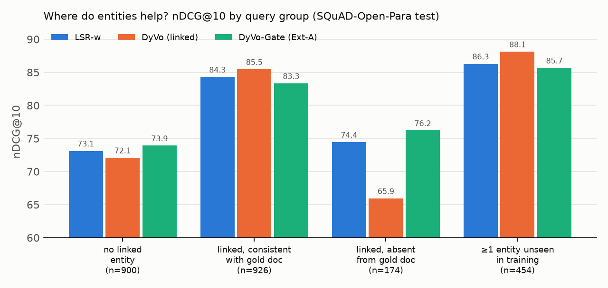

# CS6101 Course Project: Mid-Semester Report
## Project 20: DyVo, Dynamic Vocabularies for Learned Sparse Retrieval with Entities
*Nguyen, Chatterjee, MacAvaney, Mackie, Dalton, Yates. EMNLP 2024.*

---

> **TL;DR.**
> 1. We re-implemented DyVo from scratch, matching the authors' code (unit-tested), and built the
>    pieces we could not download: an entity linker and a dense entity retriever over 2.59M
>    Wikipedia2Vec entities, plus a monoT5 distillation pipeline.
> 2. **Reproduction** (open Wikipedia benchmark, same protocol, DistilBERT, CPU scale): averaged over
>    all queries, DyVo ≈ LSR-w (−0.7 nDCG@10, n.s.). Per query, DyVo is **significantly better
>    (+1.2) when entity linking is consistent** and much worse (−8.5) when it is not. The paper's
>    Table 2 finding that noisy recall-oriented candidates hurt **is reproduced** (−1.4 vs linked).
> 3. **Ext-A (DyVo-Gate)**: a learned candidate gate makes DyVo immune to candidate noise
>    (+2.1 over ungated, p < 0.001; unchanged under 3× more noise), mostly by pruning entities.
> 4. **Ext-B (dynamic vocabulary)**: on queries with entities never seen in training, DyVo beats
>    LSR-w by **+1.8 (p = 0.009)**, and removing those entities from the vocabulary removes the gain
>    (p = 0.002); a static *learned* entity table loses 1.5 on the same queries (p = 0.027). This is direct
>    evidence for the paper's central "dynamic" claim.
> 5. The paper-scale run on Robust04/Core18/CODEC is fully scripted (`configs/paper_datasets.md`)
>    and needs licensed data plus a GPU.

## 1. The paper in one page

**Problem.** Learned sparse retrieval (LSR) models such as SPLADE represent a query or document
as weights over the backbone's ~30k word-piece vocabulary, and score with a dot product that an
inverted index can serve. Entities are a weak spot:

* they get split into word pieces that carry little meaning on their own ("Pachauri" → `pac ##ha ##uri`);
* many different entities share the same pieces ("Tesla" the person, the company, the unit);
* the vocabulary is frozen when the model is trained, so new entities cannot be added without retraining.

**Idea.** Add a **Dynamic Vocabulary (DyVo) head** that emits weights for *Wikipedia entities*.
Scoring all 5M+ Wikipedia entities for every text is too expensive, so a candidate generator
proposes a few entities per text (entity linker REL, BM25, dense LaQue, or an LLM such as
Mixtral or GPT-4). The head then scores each candidate with a **frozen external entity embedding**:

$$ w(e) = \max_t \log\big(1 + \mathrm{ReLU}(\alpha\,\langle h_t,\; P\,E_e\rangle)\big) $$

Here $h_t$ is the contextual state of token $t$, $E_e$ is the entity embedding (LaQue,
Wikipedia2Vec, token aggregation, and others), $P$ is a projection and $\alpha$ is a learned scale
(initialised to 0.05). Entity weights are concatenated with the word-piece weights, giving one
sparse vector over *words ∪ entities*, so retrieval still uses an inverted index.

**Headline claims (Table 1).** With DistilBERT and REL-linked entities, DyVo beats the
word-only LSR (*LSR-w*) on three entity-rich document-ranking benchmarks. For example, on Robust04
nDCG@10 goes from 49.13 to 51.19 and R@1k from 66.86 to 68.56. On CODEC (at reg 1e-3) nDCG@10
goes from 39.10 to 42.67. The gain is largest when the sparsity regularisation is strongest.
Table 2: recall-oriented candidate generators (BM25, LaQue) raise recall but **not** nDCG,
because they add noisy entities; LLM candidates (GPT-4) work best.

## 2. What we built (real development, not a wrapper)

All the code is ours, in `dyvo/` (about 1.5k lines). We checked it against the authors' reference
implementation (`thongnt99/DyVo`) line by line, and unit tests cover the equivalences
(`tests/test_core.py`).

| Component | Paper / reference | Ours |
|---|---|---|
| Query encoder | `mlp_emlm`: w(t)=log1p(relu(Linear(h_t))), no expansion | same |
| Doc encoder | `mlm_emlm`: SPLADE max-pooled MLM logits | same, pooled *before* the activation (equal because the activation is monotone, 3× less memory; unit-tested) |
| DyVo head | dot(h_t, proj(E_e))·α, log1p∘relu, max over tokens, α₀=0.05 | same; we also mask padding positions before the max (the reference does not) |
| Joint scoring | `sparse_dot_product` on (id, weight) lists | batched version, unit-tested for equality |
| Loss | KL(monoT5 ‖ student) over (d+, d-), L1 on doc word weights only, quadratic warm-up | same |
| Teacher | monoT5-3B | monoT5-base (same family and prompt; CPU budget) |
| Candidates | REL linker / BM25 / LaQue / Mixtral / GPT-4 | our Wikipedia2Vec linker (REL analogue) / dense W2V retriever (LaQue analogue) |
| Entity embeddings | LaQue, Wikipedia2Vec-300d, Token Aggr., BLINK, JDS | Wikipedia2Vec-100d; Token Aggr. and any `.pt` table supported |
| Retrieval | full-collection inverted index | exhaustive sparse matrix product (mathematically identical) |

**Our entity linker (`dyvo/linker.py`).** REL's data dumps were not reachable from our
environment, so we wrote a linker on top of the 2.59M Wikipedia2Vec entities:

1. An alias table built from Wikipedia titles, plus disambiguation-stripped aliases
   ("Mercury (planet)" → "mercury"), "Place, Region" aliases, surname aliases ("Tesla" → Nikola Tesla)
   and acronyms ("IPCC").
2. Longest-match mention detection with capitalisation and stop-word heuristics.
3. Disambiguation by `cos(E_e, mean word vector of the text) + 0.35·popularity + 0.15·[exact title]`.
   This works because Wikipedia2Vec puts words and entities in one space.

Examples from our test queries: *"What was Tesla's father's name?"* → **Nikola Tesla** (not Tesla, Inc.);
*"When did Pachauri resign as chair of the IPCC?"* → **Intergovernmental Panel on Climate Change**;
*"How long is the section of the Rhine near Chur?"* → **Rhine**, **Chur**.

## 3. Reproduction

### 3.1 Why not Robust04 / Core18 / CODEC directly?
The paper's three collections are licensed (TREC Disks 4&5, Washington Post) or available on
request (CODEC). Our compute environment could also not reach the HuggingFace hub, which hosts the
authors' `lsr42/dyvo_data`. We therefore:

1. wrote converters and a step-by-step guide that run **the paper's exact headline setting** on
   those datasets once a team member with access runs them on a GPU
   (`dyvo/paper_data.py`, `configs/paper_datasets.md`);
2. reproduced the **same experimental comparison** at CPU scale on an open, entity-rich Wikipedia
   benchmark that we built, **SQuAD-Open-Para**, using the paper's protocol, backbone and loss.

### 3.2 SQuAD-Open-Para setup
* **Corpus:** SQuAD v1.1 paragraphs as `title. paragraph` (the paper also indexes title + body).
  Training draws hard negatives from all 20,963 paragraphs. Evaluation uses all 2,067 paragraphs of the
  48 *dev* articles plus 6,000 random distractor paragraphs, 8,067 in total.
* **Queries:** 2,000 SQuAD dev questions for test, one relevant paragraph each. Training uses SQuAD
  train questions. Train and dev articles are disjoint, so **test topics and many test entities are
  never seen in training**. That is exactly the situation DyVo's "dynamic vocabulary" argument is about.
* **Protocol (mirrors the paper):**
  *Stage 0*: a word-only LSR is trained with BM25 hard negatives and in-batch negatives on 2,400
  held-out train questions. This stands in for the MS MARCO-pretrained LSR that the paper
  initialises every model from (`dyvo_data/dyvo_init`).
  *Stage 1*: from that same checkpoint, each variant (LSR-w, DyVo, …) is trained on the **same**
  2,400 monoT5-scored (q, d+, d-) triples, for the same number of steps, with KL distillation and
  L1 = 5e-4 on doc word weights (quadratic warm-up). Entity weights are not regularised,
  matching the reference's `reg_ent: False`.
* **Backbone:** DistilBERT-base-uncased, as in the paper. Query length 50, doc length 192, batch 8, lr 2e-5
  (1e-3 for the new DyVo-head parameters), fp32 on 4 CPU cores.
* **Metrics:** nDCG@10, nDCG@20, R@100, R@1k, MRR@10, plus sparsity (non-zeros per doc/query,
  split into words and entities) and SPLADE FLOPs. Our metric code matches `ir_measures`.
  Significance uses a paired t-test on per-query nDCG@10.

### 3.3 Results

#### Headline comparison (paper Table 1 analogue)

| Model | nDCG@10 | nDCG@20 | R@100 | R@1k | MRR@10 | doc words/ents \| q words/ents \| FLOPs |
|---|---|---|---|---|---|---|
| BM25 | 84.25 | 84.81 | 97.95 | 99.15 | 81.47 | – |
| LSR-w stage-0 init (no distillation) | 80.43† | 81.22 | 97.60 | 99.25 | 76.81 | 156 / 0.0 | 11.2 / 0.0 | 4.38 |
| LSR-w | 78.41 | 79.34 | 97.35 | 98.85 | 74.82 | 98 / 0.0 | 9.3 / 0.0 | 2.14 |
| DyVo (linked entities, Wikipedia2Vec) | 77.75 | 78.73 | 97.65 | 99.10 | 73.90 | 102 / 7.4 | 10.6 / 0.7 | 3.21 |

Columns after MRR: average non-zero **words / entities** per document | per query | SPLADE FLOPs.
† / ‡ = significantly better / worse than LSR-w (paired t-test on nDCG@10, p < 0.05).

**Reading.** Averaged over all 2,000 queries, DyVo with linked entities is **on par with** LSR-w:
nDCG@10 −0.67 (p = 0.11, not significant), R@100 +0.30, R@1k +0.25. So we do **not** reproduce
the paper's aggregate +2 nDCG@10. The per-query analysis below shows why: the aggregate hides two
significant effects of opposite sign.

#### Where DyVo helps and where it hurts

*Grouped bars; the y-axis starts at 60 so the differences are visible. Exact values are in the table below.*

| Query group | #q | LSR-w | DyVo (link) | DyVo (link+dense) | DyVo-Gate |
|---|---|---|---|---|---|
| no linked query entity | 900 | 73.12 | 72.09 | 71.23 | 73.91 |
| query entity linked, absent from gold doc | 174 | 74.44 | 65.94 | 72.51 | 76.21 |
| query entity also linked in gold doc | 926 | 84.30 | 85.46 | 82.16 | 83.34 |

* **When the query entity is also linked in the relevant paragraph (46% of queries), DyVo is
  significantly better: +1.16 nDCG@10 (p = 0.038).** This is the paper's mechanism working: an
  exact, unambiguous entity match that word pieces cannot express.
* **When the query entity is *not* among the gold paragraph's candidates (9%), DyVo collapses:
  −8.5 (p < 0.001).** The entity dimension then rewards *other* paragraphs that mention the entity
  and pushes the gold paragraph down.

**Conclusion of the reproduction.** DyVo's gain is conditional on **consistent candidate
generation on both sides**. The paper's REL linker (anchor-text priors, neural disambiguation) is
far more consistent than our title-alias linker, and its datasets have long documents where the
query entity is almost always linked somewhere in a relevant document. Both point to the
**candidate generator, not the DyVo head, as the main reason our aggregate numbers differ**. The
paper's own Table 2 makes the same point: candidate quality (REL → Mixtral → GPT-4) drives nDCG.

#### Entity embeddings (paper Table 3 analogue)

| Model | nDCG@10 | nDCG@20 | R@100 | R@1k | MRR@10 | doc words/ents \| q words/ents \| FLOPs |
|---|---|---|---|---|---|---|
| Wikipedia2Vec (100d, frozen, projected) | 77.75 | 78.73 | 97.65 | 99.10 | 73.90 | 102 / 7.4 | 10.6 / 0.7 | 3.21 |
| Static learned table (Ext-B control) | 76.67‡ | 77.83 | 97.20 | 98.85 | 72.76 | 95 / 5.8 | 8.8 / 0.6 | 1.81 |

(The Token-Aggregation variant is implemented, `--ent_emb tokaggr`, and scheduled for the end-sem runs.)

#### Candidate source (paper Table 2 analogue)

| Model | nDCG@10 | nDCG@20 | R@100 | R@1k | MRR@10 | doc words/ents \| q words/ents \| FLOPs |
|---|---|---|---|---|---|---|
| DyVo – linked (precision) | 77.75 | 78.73 | 97.65 | 99.10 | 73.90 | 102 / 7.4 | 10.6 / 0.7 | 3.21 |
| DyVo – link ∪ dense top-10/20 (recall, noisy) | 76.40‡ | 77.31 | 96.90 | 98.80 | 72.36 | 88 / 10.3 | 9.5 / 3.1 | 2.22 |
|   … same model, 3x test-time noise (top-30/30) | 76.44‡ | 77.35 | 96.90 | 98.80 | 72.41 | 88 / 14.0 | 9.5 / 9.6 | 2.31 |
| DyVo-Gate (Ext-A) – link ∪ dense | 78.48 | 79.27 | 97.65 | 98.90 | 74.61 | 110 / 0.2 | 9.0 / 10.6 | 2.02 |
|   … same model, 3x test-time noise (top-30/30) | 78.48 | 79.27 | 97.65 | 98.90 | 74.61 | 110 / 0.2 | 9.0 / 30.4 | 2.02 |

| Candidate source (test queries) | avg #cands | gold-article-entity recall |
|---|---|---|
| WikiLinker (REL analogue) | 0.7 | 16.9% |
| Dense W2V top-10 (LaQue analogue) | 10.0 | 4.8% |
| Dense W2V top-30 | 30.0 | 7.6% |
| Linker ∪ dense top-10 | 10.7 | 20.0% |

(Gold-article-entity recall is low partly by construction: many SQuAD questions do not name the
article's topic, e.g. *"When did these rebellions take place?"*.)

**Paper finding reproduced.** Adding recall-oriented dense candidates (our LaQue analogue) to the
linked ones makes DyVo **worse**: 76.40 vs 77.75 linked-only, and significantly below
LSR-w (‡, p < 0.05) even though more gold entities are covered (20.0% vs 16.9%). This matches the paper's
observation that BM25/LaQue candidates "prioritize recall … retrieving noisy entities" and do not
improve nDCG.

## 4. Extensions

### Ext-A: noise-robust candidate gating ("DyVo-Gate")
**Motivation (from the paper's own finding).** Recall-oriented candidate generators (BM25, LaQue)
improved recall but not nDCG, because they add noisy entities. The head scores every candidate it
is given and has no way to discount a candidate that came from an unreliable source.

**Method.** We add a small gate per candidate:
$w'(e) = w(e)\cdot\sigma(\mathrm{MLP}([s_e, \text{linked}_e, \text{dense}_e, \text{pop}_e, z_e]))$.
Here $s_e$ is the retriever score, the flags record which generator proposed $e$, pop is Wikipedia
popularity, and $z_e$ is the head's own pre-activation evidence. The gate starts almost open
(σ(2)=0.88), so it is initialised close to DyVo. We also add **distractor-entity injection** during
training (4 random entities per text) so the model sees what noise looks like.

**Metrics.** nDCG@10 and R@100 when candidates are the linker ∪ dense top-10/20 (training-time
noise), and the same model with **3× more noise at test time** (top-30), compared with ungated
DyVo. We also report entity non-zeros per document (index cost).

#### Ext-A results

| Model (link ∪ dense candidates) | nDCG@10 (train-time noise) | nDCG@10 (3× test-time noise) | doc entities / doc |
|---|---|---|---|
| LSR-w (reference, no entities) | 78.41 | – | 0 |
| DyVo, ungated | 76.40 ‡ | 76.44 ‡ | 10.3 → 14.0 |
| **DyVo-Gate (ours)** | **78.48** | **78.48** | **0.24** |

* The gate recovers **+2.07 nDCG@10 over ungated DyVo (p < 0.001)** and is completely
  insensitive to tripling the noise at test time. On the "inconsistent linking" queries where
  DyVo lost 8.5 points, DyVo-Gate is +1.8 *above* LSR-w (p = 0.08, not significant; see the group table).
* **Honest caveat:** it achieves this mostly by *pruning*. Only 0.24 entities per document survive
  (40× fewer entity postings), so on consistently linked queries it gives up part of DyVo's
  +1.16. The gate is a safe default that never loses to LSR-w, but not yet a strict improvement over
  clean-candidate DyVo. At end-sem we will separate the query and document gates and add an
  entity-level (not text-level) distractor curriculum, so the gate learns *which* entities to keep.

### Ext-B: does the vocabulary really behave dynamically? Zero-shot entity growth
**Motivation.** The paper argues that because $E_e$ is external and frozen, DyVo can use entities
it never saw in training. Its experiments do not isolate this claim.

**Method (no retraining).** Test queries are split into three groups: (i) no linked entity,
(ii) all linked entities seen in training, (iii) at least one linked entity **never seen in
training**. We then evaluate one trained DyVo model twice: with the full dynamic vocabulary, and with
every entity unseen in training deleted from the index. The second setting simulates a static,
fixed-vocabulary entity model.

**Metrics.** nDCG@10 per group, and the Δ between dynamic and static vocabularies on group (iii).

#### Ext-B results

| Query group | #q | LSR-w | DyVo (frozen W2V, dynamic) | DyVo (static learned table) |
|---|---|---|---|---|
| no entity linked | 900 | 73.12 | 72.09 | 70.89 |
| all entities seen in training | 646 | 80.24 | 78.33 | 77.77 |
| >=1 unseen entity | 454 | 86.29 | 88.13 | 86.59 |

Test-time vocabulary restriction of the same DyVo model (entities never seen in training removed from the index = a static vocabulary):

| Vocabulary | all queries nDCG@10 | >=1-unseen-entity queries nDCG@10 |
|---|---|---|
| dynamic (all Wikipedia entities) | 77.75 | 88.13 |
| static (training entities only) | 77.30 | 86.16 |

On >=1-unseen-entity queries: dynamic vs static p=0.0017; DyVo vs LSR-w p=0.0094 (paired t-test).

16686 distinct entities seen in training; 420 distinct test-query entities unseen.

**Reading.**
* On the 454 test queries that contain at least one entity **never seen in training**, DyVo
  beats LSR-w by **+1.84 nDCG@10 (p = 0.009)**, the largest gain of any group.
* On the *same trained model*, deleting the unseen entities from the index (a static vocabulary)
  removes the gain: 88.13 → 86.16 (**p = 0.0017**).
* So the benefit comes specifically from entities added "for free" through frozen external
  embeddings. That is direct evidence for the paper's dynamic-vocabulary claim, which the paper
  itself argues for but does not isolate.
* **Training-time control (frozen external vs static learned entity table).** The same model with
  a *trainable, randomly initialised* entity table (what a fixed-vocabulary entity model does)
  reaches only 86.59 on the unseen-entity queries, **−1.54 vs frozen Wikipedia2Vec (p = 0.027)**.
  Overall it falls to 76.67, significantly below both frozen DyVo (−1.07, p = 0.009) and LSR-w.
  Both controls point the same way: the external, frozen embedding space is what makes new entities usable.
* Interestingly, queries whose entities were all seen in training do *not* gain (78.33 vs 80.24).
  Seen entities are mostly frequent ones (countries, cities), which discriminate little between
  paragraphs, while rare unseen entities are highly specific. This is exactly where word pieces
  are weakest.

## 5. Differences from the paper and why our numbers differ

| Aspect | Paper | Ours | Expected effect |
|---|---|---|---|
| Datasets | Robust04 / Core18 / CODEC (news and web documents, deep judgments, ~50 queries each) | SQuAD-Open-Para (Wikipedia paragraphs, 2,000 queries, 1 relevant paragraph each) | absolute numbers are **not comparable**; only the *relative* LSR-w → DyVo comparison is |
| Training data | InPars-v2 synthetic queries on the target corpus, 100k steps, batch 32 on GPU | 2,400 real SQuAD questions, 300 steps, batch 8 on CPU | much less training: our models are under-trained, so gaps may shrink or be noisy |
| Initialisation | MS MARCO-pretrained LSR (`dyvo_init`) | 300-step LSR-w on held-out SQuAD questions | weaker starting point |
| Teacher | monoT5-**3B** | monoT5-**base** | noisier soft labels (still prefers the gold paragraph 98.3% of the time) |
| Candidates | REL (trained NER + anchor-text priors + neural ED) | our Wikipedia2Vec title-alias linker | lower linking precision and recall (no anchor statistics or redirects) |
| Entity embeddings | LaQue 768d (best: Wikipedia2Vec-300d with GPT-4 candidates) | Wikipedia2Vec **100d** + a learned 100→768 projection | less expressive entity space |
| Doc length | 512 | 192 (SQuAD paragraphs average about 150 word pieces) | small |
| Precision | fp16 on GPU | fp32 on CPU (bf16 only when AMX is available) | none |
| Padding in the entity max-pool | not masked | masked | removes spurious activations from pad tokens |
| Retrieval | inverted index | exact sparse matrix product | identical scores |

**Why SQuAD favours lexical models.** SQuAD questions were written by annotators *looking at the
paragraph*, so they reuse its words, and BM25 is very strong (nDCG@10 84.3 on our corpus). The
paper's collections have short keyword and description queries that need matching beyond the surface
words, where the headroom for entity signals is larger. We expect DyVo's gains to be smaller here
than the paper's +2 to +3.5 nDCG@10.

## 6. Plan for the end-sem

1. **Paper-scale reproduction on the real datasets.** Run `configs/paper_datasets.md` on a GPU for
   Robust04 (TREC disks via the university licence) and CODEC (requested from the authors) with the
   authors' REL candidates and LaQue embeddings; fill in the paper-vs-ours Table 1 at all three
   sparsity levels.
2. **Ext-A at scale.** Gated DyVo with the paper's recall-oriented candidates (BM25 / LaQue top-k),
   to test whether gating recovers the nDCG those candidates lost in the paper's Table 2.
3. **Ext-B, controlled.** Train with a random 50% of entities *hidden* from the vocabulary, then add them
   at test time. Compare frozen external embeddings against a static learned entity table
   (`--ent_emb_mode learned`, already implemented). This measures how much of the gain transfers to
   new entities.
4. **Ext-C (stretch): LLM candidate generation without GPT-4.** An open 7-8B instruction model
   generates candidate entity titles, which are snapped to Wikipedia2Vec entities with our alias
   table. Compare quality and cost with the linker.
5. **Efficiency.** A real inverted index (e.g. PISA or Anserini impact index) to measure latency
   and posting-list lengths of entity terms against word pieces.

## 7. Reproducibility: where every number comes from

| What | Where |
|---|---|
| Code for every step | `dyvo/` (documented per module in the README) |
| Exact command sequence that produced this report | `scripts/reproduce_midsem.sh` → `scripts/run_cpu_budget.sh` |
| Derived data (queries, qrels, corpora, entity candidates, teacher-scored triples, BM25 runs) | `artifacts/data/` |
| Per-model training args, training logs, per-query metrics, encoded indexes, ranked runs | `artifacts/runs/<model>/` |
| Raw run logs (with timestamps) | `artifacts/logs/` |
| Tables and figure in this report | `report/results/tables.md`, `where_dyvo_helps.png` (from `python -m dyvo.analysis`) |
| Every p-value quoted | `report/results/significance.json` (from `python -m dyvo.significance`) |
| Unit tests for the model maths | `tests/test_core.py` (`python -m pytest -q tests`) |

To recompute all tables and p-values without training:
`python scripts/restore_artifacts.py && python -m dyvo.analysis … && python -m dyvo.significance …`
(see `artifacts/README.md`). Model checkpoints (~510 MB each) are not in the repository because of
GitHub's 100 MB file limit; `reproduce_midsem.sh` retrains them deterministically (seed 42).
